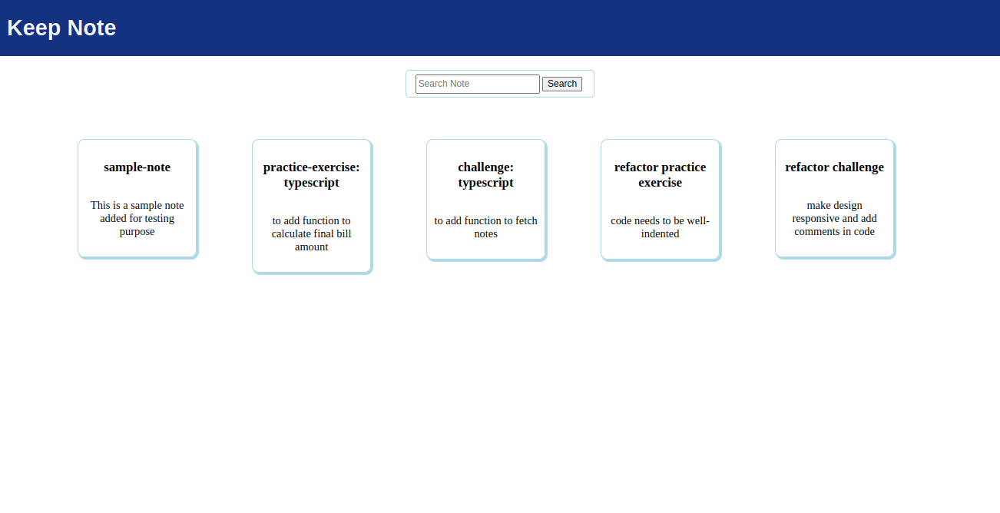
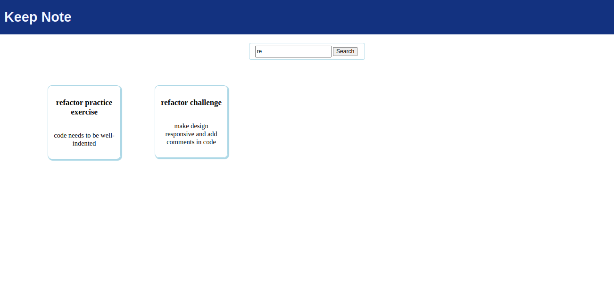

# Challenge - Keep Note

## Context

Keep Note is a web app that lets users maintain notes. The app should be designed as a single-page application. ​
​
In the current development phase, the app should read notes residing externally in the form of an array. For convenience, the app should provide search functionality to allow users to search for notes by note title. ​

Create the angular application using Angular CLI commands. ​

## Problem Statenet

Keep Note is a web app that lets users maintain notes. The app should display notes and be able to search for notes by title. ​

Design a single-page application using Angular CLI. Below is the preview of the expected single page output.
 

### Task Details

The solution for this challenge can be created in 5 steps.​

#### Step 1: Create Components​
   - Create an Angular application `Keep-Note` using Angular CLI command.​
                   ng new --skip-tests keep-note​
   - Create `Header` and `Dashboard` components inside the `app` folder.​
   - Use Angular CLI command `ng generate component <component-name>` or `ng g c <component-name>` to create components.​
   - Render the components using a component selector as per the hierarchy. ​

        - `App` component should render `Header` and `Dashboard` components.​
        - `Header` component should render the app title `Keep Note`.​
        - `Dashboard` component should display a search textbox followed by a list of notes in tile format.

#### Step 2: Create Data Models​
   - Create data models under the folder with the name `models`.​
   - Create type `Note` in the `note.ts` file in the `models` folder with the following type properties:​
        - id (number)​
        - title (string)​
        - content (string)
   - Create constant `Notes` in `notes.ts` file in `models` folder.​
   - The `Notes` constant should store an array with the following notes data: 
  
 | id  | title                         | content                                         |
 | --- | ----------------------------- | ----------------------------------------------- |
 | 1   | sample-note                   | This is a sample note added for testing purpose |
 | 2   | practice-exercise: typescript | to add function to calculate final bill amount  |
 | 3   | challenge: typescript         | to add function to fetch notes                  |
 | 4   | refactor practice exercise    | code needs to be well-indented                  |
 | 5   | refactor challenge            | make design responsive and add comments in code |  ​

#### Step 3: Design App Header​
  - Modify the `Header` component to display the app title `Keep Note.` ​
  - The below image shows a sample layout of the header. ​
  - Background color can be different but should be aesthetically pleasing. ​

#### Step 4: Display Notes​
  - `Dashboard` component should read notes from the `NOTES` array defined in the `Notes.ts` file.​
  - The `Dashboard` component should traverse the `notes` array using  the`*ngFor` directive and render the properties (title and content) of the `note` object to display note data.​

#### Step 5: Search Notes
  - Design the UI for search functionality by adding a text box and a search button.​
  - Declare `searchText` as a component property and bind it with the template using ngModel to capture the value when the user types in the search text box.​
  - Add the `Search` button, which calls the component's searchNote() method whenever the button is clicked using the event binding technique.​
        `<button (click) = "searchNote()" type = button>Search</button>`​
  - Write the search logic inside the searchNote() method to filter the notes using the Array filter method.​
     - All notes should be displayed when the search text is empty.​
- Below is the preview of the sample output of the Keep Note app with search functionality.

